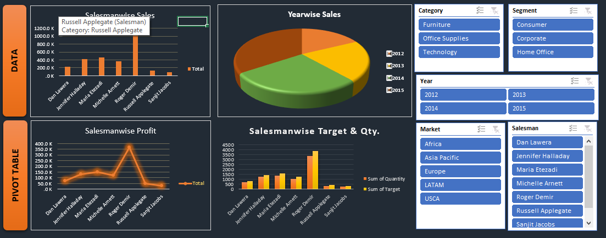

# 📊 Sales Performance MIS Dashboard

### 🚀 Excel-Based Business Intelligence & MIS Reporting Project

Analyze sales performance, KPI metrics, revenue trends, and business insights through an interactive MIS dashboard.

---

# 📌 Project Overview

The **Sales Performance MIS Dashboard** is an Excel-based reporting and analytics project designed to monitor and evaluate business sales performance.  

This dashboard helps businesses track:
- 📈 Revenue Growth
- 💰 Profit Analysis
- 🎯 Target Achievement
- 👨‍💼 Salesperson Performance
- 🛒 Category-wise Sales Trends

The project focuses on transforming raw sales data into meaningful business insights for reporting and decision-making.

---

# ✨ Key Features

✅ Interactive MIS Dashboard  
✅ KPI-Based Reporting  
✅ Sales & Profit Analysis  
✅ Salesperson Performance Tracking  
✅ Monthly Sales Trend Analysis  
✅ Category-wise Business Insights  
✅ Pivot Table Reporting  
✅ Conditional Formatting & Visualization  

---

# 🛠️ Tools & Technologies Used

| Tool | Purpose |
|------|---------|
| Microsoft Excel | Data Analysis & Dashboarding |
| Pivot Tables | Business Reporting |
| Charts & Graphs | Data Visualization |
| Conditional Formatting | KPI Highlighting |

---

# 📊 Business KPIs Tracked

- Total Revenue
- Total Profit
- Sales Growth
- Target vs Actual Performance
- Top Performing Categories
- Salesperson Productivity

---

# 📈 Business Insights Generated

🔹 Identified high-performing sales categories  
🔹 Compared target vs actual sales metrics  
🔹 Analyzed monthly revenue and profit trends  
🔹 Evaluated salesperson performance using KPI reports  

---

# 📷 Dashboard Preview

